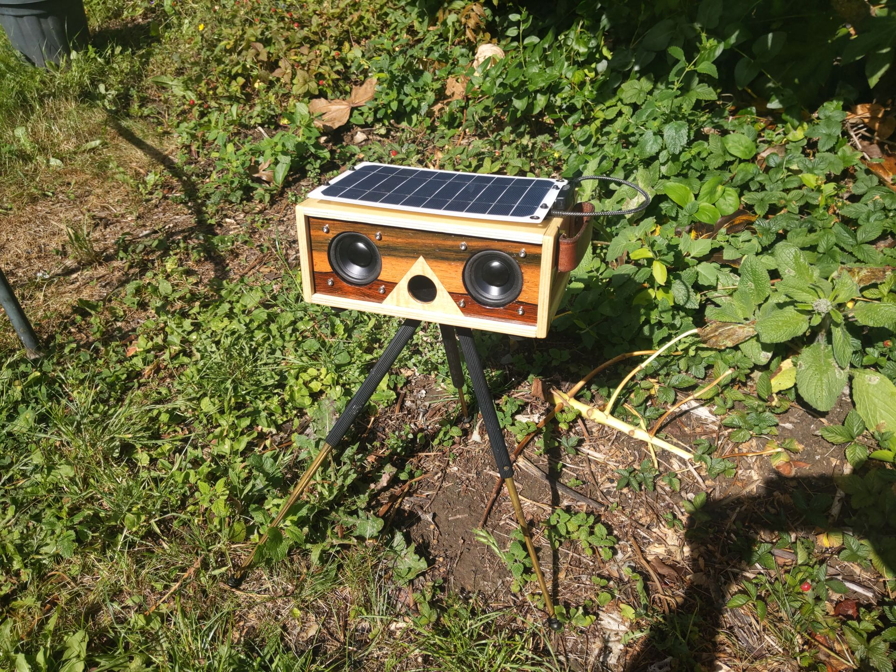
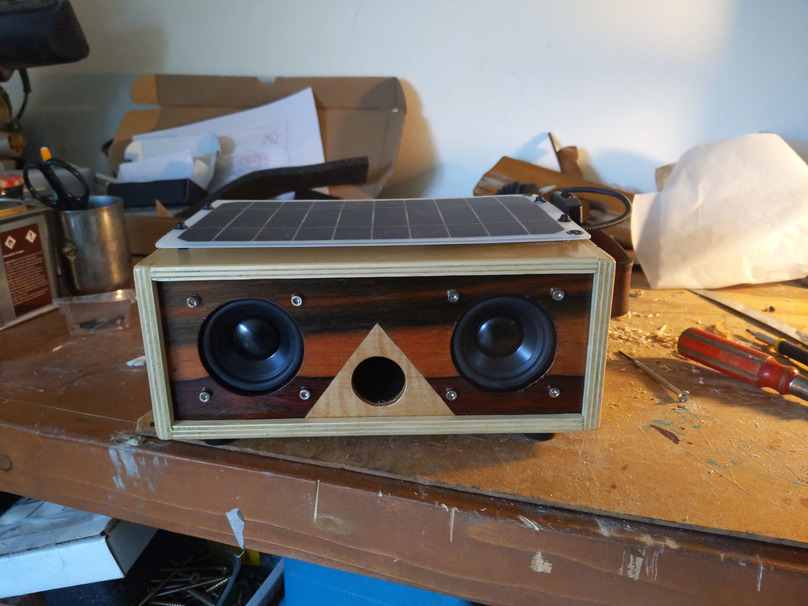
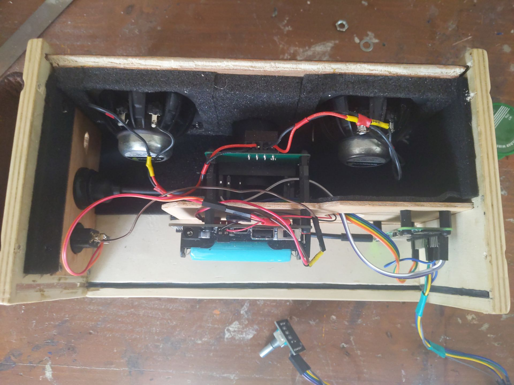
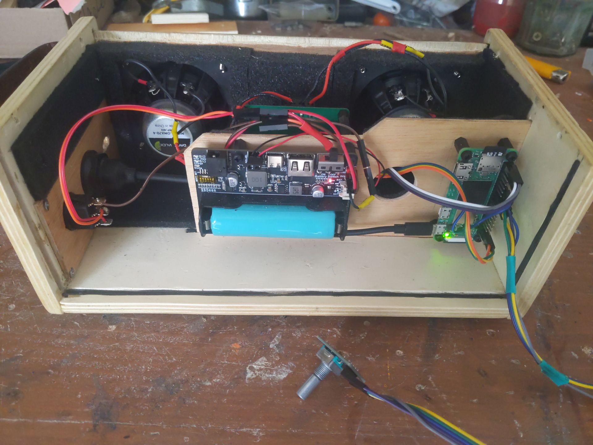
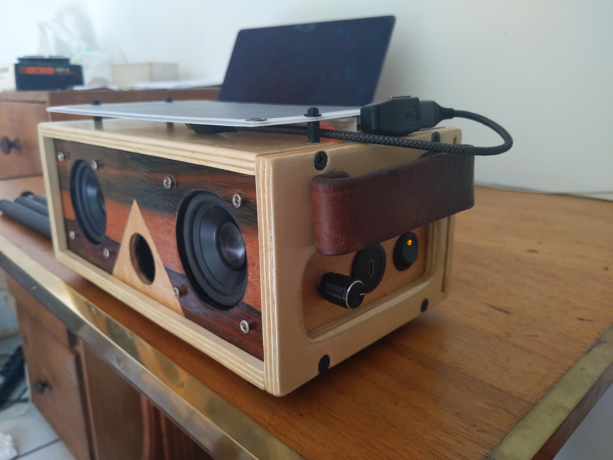
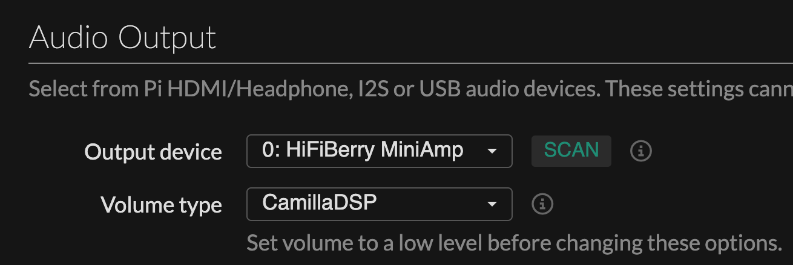

# OaKhz - DIY wireless bluetooth speaker

This educational project aims to build a prototype of a Bluetooth speaker that is detachable, reusable, and repairable, using open-source softwares, standards, and norms as much as possible.

[](./.github/img/photo.jpg)
[](./.github/img/photo2.jpg)
[](./.github/img/inside.jpg)
[](./.github/img/inside2.jpg)
[](./.github/img/side.jpg)

## 📑 SUMMARY

- [✨ Features](#-features)
- [🔌 Hardware](#-hardware)
  - [📦 Boards and components](#-boards-and-components)
  - [🔋 Power](#-power)
  - [🔧 Misc](#-misc)
- [🧪 User Feedback](#-user-feedback)
- [💽 Install Moode Audio](#-install-moode-audio)
- [🔈 DAC : HiFiBerry MiniAmp](#-dac--hifiberry-miniamp)
  - [test](#-test)
  - [⚙️ GPIO DAC wiring](#-gpio-dac-wiring)
  - [⚙️ UI Settings](#-ui-settings)
- [🎛 Rotary Encoder](#-rotary-encoder)
  - [⚙️ GPIO rotary wiring](#-gpio-rotary-wiring)
  - [📈 Volume control](#-volume-control)
  - [📈 Volume control](#-volume-control)
  - [🧠 Smart button](#-smart-button)
- [📊 Equalizer with CamillaDSP](#-equalizer-with-camillaDSP)
- [🔊 Sound notification setup](#-sound-notification-setup)
  - [📶 Bluetooth ready sound notification](#-bluetooth-ready-sound-notification)
  - [🛑 Pi Zero shutdown sound notification](#-pi-zero-shutdown-sound-notification)
- [📻 Install Plexamp](#-plexamp-setup)
- [📚 Resources](#-resources)

&nbsp;

## ✨ FEATURES

- Switchable standard format battery 18650
- Battery powered by solar panel
- Raspberry pi zero powered by the battery
- Bluetooth connexion (pin optional)
- Rotary encoder volume (bluetooth + local)
- Use of camillaDSP
- Moode UI accessible by URL:
  - Using preset wifi network if reachable
  - Using wifi hotspot if the preset network is not reachable,.
- Bluetooth ready sound notification
- Graceful shutdown with sound notification

&nbsp;

## 🔌 HARDWARE

### 📦 Boards and components

- Raspberry PI zero 2 W ([link](https://www.raspberrypi.com/products/raspberry-pi-zero-2-w/))
- Hifiberry DAC - Mini Amp 1.0 ([link](https://www.hifiberry.com/shop/boards/miniamp/))
- SeenGreat - Solar management ([link](https://seengreat.com/wiki/104/solar-energy-manager))
- DMA70-4 x2 ([link](https://www.daytonaudio.com/product/1616/dma70-4-2-1-2-dual-magnet-aluminum-cone-full-range-driver-4-ohm))

### 🔋 Power

- Battery 18650 x1
- Solar panel ([link](https://www.amazon.fr/dp/B09F3LWLJ1))

### 🔧 Misc

- Jumper Wire ([link](https://www.amazon.fr/dp/B07K8PVKBP?ref=ppx_yo2ov_dt_b_fed_asin_title))
- ON/OFF switch ([link](https://www.amazon.fr/dp/B0DM6HN1LB?ref=ppx_yo2ov_dt_b_fed_asin_title))
- Rotary encoder ([link](https://www.amazon.fr/dp/B0CN7D16BC?ref=ppx_yo2ov_dt_b_fed_asin_title))
- Micro SD Card

&nbsp;

## 🧪 USER FEEDBACK

**Sound quality +++**

After some adjustments using Moode’s Graphic EQ, the sound quality is more than decent.
Be careful with low-frequency vibrations — it's important to properly isolate and secure each component to avoid any unwanted buzzing or rattling.

**Battery duration ++**

Battery life with a 18650 cell: ~3 hours

**Solar charging ---**

Battery charging via solar panel: Very disappointing.
I believe the chosen solar panel is of very poor quality.
Efficiency should be much better with a more powerful and better-manufactured solar panel.

&nbsp;

## 💽 INSTALL MOODE AUDIO

1- Install [raspberry PI Imager](https://www.raspberrypi.com/software/)  
2- I picked [Moode Audio](https://moodeaudio.org/) image  
3- Preset wifi and user infos  
4- Set the sd card in the pi zero and boot  
5- Moode UI should be reachable: `http://<hostname>.local` or `http://172.24.1.1`

&nbsp;

## 🔈 DAC : HiFiBerry MiniAmp

### ⚙️ GPIO DAC wiring

[](https://indibit.de/wp-content/uploads/2015/08/Raspberry-Pi-2-Model-B-GPIO-Belegung.png)

| Function               | GPIO (logical name) | Physical Pin | Description                                     |
| ---------------------- | ------------------- | ------------ | ----------------------------------------------- |
| I2S - Bit Clock (BCLK) | GPIO 18             | Pin 12       | Audio data clock signal                         |
| I2S - LR Clock (LRCK)  | GPIO 19             | Pin 35       | Selects left or right audio channel             |
| I2S - Data Out (DIN)   | GPIO 20             | Pin 38       | Audio data sent to the DAC                      |
| I2S - Enable / Mute    | GPIO 21             | Pin 40       | Enables or mutes output (depending on use case) |
| Logic Power            | 3.3V                | Pin 1        | Power supply for logic-level circuits           |
| Power Supply           | 5V                  | Pin 2 (or 4) | Main power supply for the amplifier module      |
| Ground (GND)           | GND                 | Pin 6        | Voltage reference / power return                |

### ⚙️ UI settings

1. Boot Moode Audio.
2. Go to audio settings and set **"Named I2S device"** to **"HifiBerry MiniAmp"**
3. Reboot
4. Go to audio settings and set **"Output device"** to **"0:HifiBerry MiniAmp"**
5. Sound should output from the DAC

&nbsp;
&nbsp;

## 🎛 ROTARY ENCODER

### ⚙️ GPIO rotary wiring

[](./img/rotary-encoder.jpg)

&nbsp;
| Function | GPIO (logical name) | Physical Pin | Connected to | Description |
| ------------------------ | ------------------- | ------------ | ------------ | ---------------------------------------------------- |
| Encoder - Signal A (CLK) | GPIO 23 | Pin 16 | CLK | First quadrature output to detect rotation direction |
| Encoder - Signal B (DT) | GPIO 24 | Pin 18 | DT | Second quadrature output (phase-shifted) |
| Built-in Push Button | GPIO 22 | Pin 15 | SW | Detects short or long press |
| Logic Power | 3.3V | Pin 17 | VCC | Power supply for the rotary encoder |
| Ground (GND) | GND | Pin 20 | GND | Voltage reference for the entire encoder circuit |

&nbsp;
&nbsp;

### 📈 Volume control

The HifiBerry Miniamp doesn't have any amixer controls because the PCM5102A chip **doesn't include any hardware volume control**.

You can't use amixer as-is — you need to add a **software volume control** (softvol).

But using softvol by-pass Graphiq EQ configuration set in Moode UI.

In order to get volume management with rotary encore and apply an equalizer, we need use **softvol** with **CamillaDSP**.

<pre>
ℹ️​ Bluetooth sound process
--------------------------
&nbsp;
[Bluetooth (BlueZ + BlueALSA)]
         ↓
[bluealsa-aplay]  ← reads the A2DP audio stream
         ↓
[softvol] ← software volume, controllable via `amixer`
         ↓
[ALSA plugin layer]
         ↓
[camilladsp] ← DSP processing (EQ, filters, balance…)
         ↓
[HiFiBerry MiniAmp sound card]
</pre>

Edit or create :

```bash
sudo nano /etc/asound.conf
```

➡️ [**See file content**](./filesystem/etc/asound.conf)

Reboot and stream some music to the pi using bluetooth.
Test volume control :

```bash
amixer -D default sset 'SoftMaster' 10%,10%
amixer -D default sset 'SoftMaster' 5%+
amixer -D default sset 'SoftMaster' 5%-
```

Update `/var/www/daemon/rotenc.py` (line ~162) to increase or decrease bluetooth volume using amixer :

```python
amixer_vol = max(0, min(100, new_volume))
subprocess.run(
        ["amixer", "-D", "default", "set", "'SoftMaster'", f"{amixer_vol}%"],
        stdout=subprocess.DEVNULL,
)
```

&nbsp;

### 🧠 Smart button

Set 2 actions to push button :

1. Short press : mute/unmute
2. Long press : gracefull pi shutdown
3. Double press : switch CamillaDSP equalizer config

Update Moode `rotenc.py` file :

➡️ [**See file content (/var/www/daemon/rotenc.py)**](./filesystem/var/www/daemon/rotenc.py)

&nbsp;

## 📊 EQUALIZER with CamillaDSP

In order to use equalizer feature with the Hifiberry Miniamp and softvol (required to use the rotary encoder) we can use **CamillaDSP**

Set `Volume Type` to `CamillaDSP` :

[](./.github/img/camilla-moode.png)

---

In bottom of the audio settings page, you will find `Equalizers` section.<br />
Here you can activate the CamillaDSP equalizer feature and set a config.

You can also create new config file and upload them :

1. Click on `EDIT` CamillaDSP button.
2. In `File management` section click on `upload` to select config file
3. On top of the page, in `Signal processing` selector, pick your new configuration. 

&nbsp;

Here are 2 config file samples including a 10 bands equalizer :<br /><br />
[➡️ Default EQ profile](./config/OaKhz-Default.yml)<br />
[➡️ Loudness EQ profile](./config/OaKhz-Loudness.yml)

---

&nbsp;

It can be useful to adjust selected configuration in live :

1. In the Camilla DSP edit screen, in `Pipeline Editor` active the `status` toggle.
2. Click on `OPEN` button.
3. In `Filters` tab, you can modify equalizer band values.

&nbsp;

## 🔊 SOUND NOTIFICATION SETUP

**Play sound when :**

- pi zero bluetooth is aparairable
- pi zero is paired with another device over bluetooth
- pi zero is shutting down

&nbsp;
&nbsp;

1- Install dependencies to be able to read mp3 files.

```bash
sudo apt-get install sox libsox-fmt-all
```

2- Move mp3 files to `/usr/share/sounds/`folder.

&nbsp;

### 📶 Bluetooth ready sound notification

**1. Create executable**

```bash
sudo nano /usr/local/bin/play-bluetooth-ready.sh
```

➡️ [**See file content (/usr/local/bin/play-bluetooth-ready.sh)**](./filesystem/usr/local/bin/play-bluetooth-ready.sh)


```bash
sudo chmod +x /usr/local/bin/play-bluetooth-ready.sh
```

**2. Create service**

Service :

```bash
sudo nano /etc/systemd/system/bluetooth-ready-sound.service
```

➡️ [**See file content (/usr/local/bin/play-bluetooth-ready.sh)**](./filesystem/etc/systemd/system/bluetooth-ready-sound.service)

Enable and start service :

```bash
sudo systemctl daemon-reexec
sudo systemctl enable --now bluetooth-ready-sound.service
```

&nbsp;

### 🛑 Pi Zero shutdown sound notification

**1. Create executable**

```bash
sudo nano /usr/local/bin/play-shutdown-sound.sh
```

➡️ [**See file content (/usr/local/bin/play-shutdown-sound.sh)**](./filesystem/usr/local/bin/play-shutdown-sound.sh)

```bash
sudo chmod +x /usr/local/bin/play-shutdown-sound.sh
```

**2. Create Service**

```bash
sudo nano /etc/systemd/system/shutdown-sound.service
```

➡️ [**See file content (/etc/systemd/system/shutdown-sound.service)**](./filesystem/etc/systemd/system/shutdown-sound.service)
&nbsp;
&nbsp;

Enable and start service :

```bash
sudo systemctl daemon-reexec
sudo systemctl enable shutdown-sound.service
```

&nbsp;


## 📻 PLEXAMP SETUP

http://oakhz.local/setup_3rdparty_plexamp.txt

## 📚 RESOURCES

- Moode doc : https://github.com/moode-player/docs/blob/main/setup_guide.md#43-hotspot
- MP3 sound effects : https://pixabay.com/sound-effects
