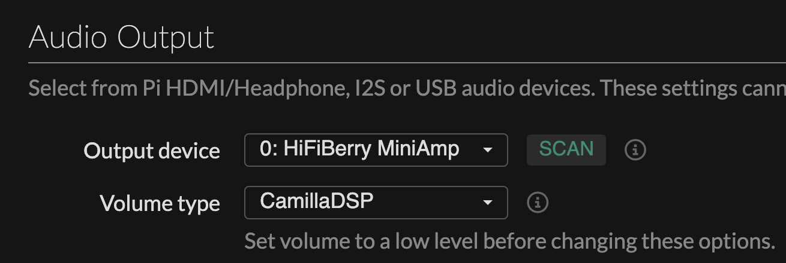

# OaKhz - DIY wireless bluetooth speaker

This educational project aims to build a prototype of a Bluetooth speaker that is detachable, reusable, and repairable, using open-source softwares, standards, and norms as much as possible.

[](./img/photo.jpg)
[](./img/photo2.jpg)
[](./img/inside.jpg)
[](./img/inside2.jpg)

## 📑 SUMMARY

- [✨ Features](#-features)
- [🔌 Hardware](#-hardware)
  - [📦 Boards and components](#-boards-and-components)
  - [🔋 Power](#-power)
  - [🔧 Misc](#-misc)
- [🧪 User Feedback](#-user-feedback)
- [💽 Install Moode Audio](#-install-moode-audio)
- [🔈 DAC : HiFiBerry MiniAmp](#-dac--hifiberry-miniamp)
  - [test](#-test)
  - [⚙️ GPIO DAC wiring](#-gpio-dac-wiring)
  - [⚙️ UI Settings](#-ui-settings)
- [🎛 Rotary Encoder](#-rotary-encoder)
  - [⚙️ GPIO rotary wiring](#-gpio-rotary-wiring)
  - [📈 Volume control](#-volume-control)
  - [📈 Volume control](#-volume-control)
  - [🧠 Smart button](#-smart-button)
- [📊 Equalizer with CamillaDSP](#-equalizer-with-camillaDSP)
- [🔊 Sound notification setup](#-sound-notification-setup)
  - [📶 Bluetooth ready sound notification](#-bluetooth-ready-sound-notification)
  - [🛑 Pi Zero shutdown sound notification](#-pi-zero-shutdown-sound-notification)
- [📻 Install Plexamp](#-plexamp-setup)
- [📚 Resources](#-resources)

&nbsp;

## ✨ FEATURES

- Switchable standard format battery 18650
- Battery powered by solar panel
- Raspberry pi zero powered by the battery
- Bluetooth connexion (pin optional)
- Rotary encoder volume (bluetooth + local)
- Use of camillaDSP
- Moode UI accessible by URL:
  - Using preset wifi network if reachable
  - Using wifi hotspot if the preset network is not reachable,.
- Bluetooth ready sound notification
- Graceful shutdown with sound notification

&nbsp;

## 🔌 HARDWARE

### 📦 Boards and components

- Raspberry PI zero 2 W ([link](https://www.raspberrypi.com/products/raspberry-pi-zero-2-w/))
- Hifiberry DAC - Mini Amp 1.0 ([link](https://www.hifiberry.com/shop/boards/miniamp/))
- SeenGreat - Solar management ([link](https://seengreat.com/wiki/104/solar-energy-manager))
- DMA70-4 x2 ([link](https://www.daytonaudio.com/product/1616/dma70-4-2-1-2-dual-magnet-aluminum-cone-full-range-driver-4-ohm))

### 🔋 Power

- Battery 18650 x1
- Solar panel

### 🔧 Misc

- Jumper Wire ([link](https://www.amazon.fr/dp/B07K8PVKBP?ref=ppx_yo2ov_dt_b_fed_asin_title))
- ON/OFF switch ([link](https://www.amazon.fr/dp/B0DM6HN1LB?ref=ppx_yo2ov_dt_b_fed_asin_title))
- Rotary encoder ([link](https://www.amazon.fr/dp/B0CN7D16BC?ref=ppx_yo2ov_dt_b_fed_asin_title))
- Micro SD Card

&nbsp;

## 🧪 USER FEEDBACK

**Sound quality +++**

After some adjustments using Moode’s Graphic EQ, the sound quality is more than decent.
Be careful with low-frequency vibrations — it's important to properly isolate and secure each component to avoid any unwanted buzzing or rattling.

**Battery duration ++**

Battery life with a 18650 cell: ~3 hours

**Solar charging ---**

Battery charging via solar panel: Very disappointing.
I believe the chosen solar panel is of very poor quality.
Efficiency should be much better with a more powerful and better-manufactured solar panel.

&nbsp;

## 💽 INSTALL MOODE AUDIO

1- Install [raspberry PI Imager](https://www.raspberrypi.com/software/)  
2- I picked [Moode Audio](https://moodeaudio.org/) image  
3- Preset wifi and user infos  
4- Set the sd card in the pi zero and boot  
5- Moode UI should be reachable: `http://<hostname>.local` or `http://172.24.1.1`

&nbsp;

## 🔈 DAC : HiFiBerry MiniAmp

### ⚙️ GPIO DAC wiring

[](https://indibit.de/wp-content/uploads/2015/08/Raspberry-Pi-2-Model-B-GPIO-Belegung.png)

| Function               | GPIO (logical name) | Physical Pin | Description                                     |
| ---------------------- | ------------------- | ------------ | ----------------------------------------------- |
| I2S - Bit Clock (BCLK) | GPIO 18             | Pin 12       | Audio data clock signal                         |
| I2S - LR Clock (LRCK)  | GPIO 19             | Pin 35       | Selects left or right audio channel             |
| I2S - Data Out (DIN)   | GPIO 20             | Pin 38       | Audio data sent to the DAC                      |
| I2S - Enable / Mute    | GPIO 21             | Pin 40       | Enables or mutes output (depending on use case) |
| Logic Power            | 3.3V                | Pin 1        | Power supply for logic-level circuits           |
| Power Supply           | 5V                  | Pin 2 (or 4) | Main power supply for the amplifier module      |
| Ground (GND)           | GND                 | Pin 6        | Voltage reference / power return                |

### ⚙️ UI settings

1. Boot Moode Audio.
2. Go to audio settings and set "Named I2S device" to "HifiBerry MiniAmp"
3. Reboot
4. Go to audio settings and set "Output device" to "0:HifiBerry MiniAmp"
5. Sound should output from the DAC

&nbsp;
&nbsp;

## 🎛 ROTARY ENCODER

### ⚙️ GPIO rotary wiring

[](./img/rotary-encoder.jpg)

&nbsp;
| Function | GPIO (logical name) | Physical Pin | Connected to | Description |
| ------------------------ | ------------------- | ------------ | ------------ | ---------------------------------------------------- |
| Encoder - Signal A (CLK) | GPIO 23 | Pin 16 | CLK | First quadrature output to detect rotation direction |
| Encoder - Signal B (DT) | GPIO 24 | Pin 18 | DT | Second quadrature output (phase-shifted) |
| Built-in Push Button | GPIO 22 | Pin 15 | SW | Detects short or long press |
| Logic Power | 3.3V | Pin 17 | VCC | Power supply for the rotary encoder |
| Ground (GND) | GND | Pin 20 | GND | Voltage reference for the entire encoder circuit |

&nbsp;
&nbsp;

### 📈 Volume control

The HifiBerry Miniamp doesn't have any amixer controls because the PCM5102A chip **doesn't include any hardware volume control**.

You can't use amixer as-is — you need to add a **software volume control** (softvol).

But using softvol by-pass Graphiq EQ configuration set in Moode UI.

In order to get volume management with rotary encore and apply an equalizer, we need use **softvol** with **CamillaDSP**.

<pre>
ℹ️​ Bluetooth sound process
--------------------------
&nbsp;
[Bluetooth (BlueZ + BlueALSA)]
         ↓
[bluealsa-aplay]  ← reads the A2DP audio stream
         ↓
[softvol] ← software volume, controllable via `amixer`
         ↓
[ALSA plugin layer]
         ↓
[camilladsp] ← DSP processing (EQ, filters, balance…)
         ↓
[HiFiBerry MiniAmp sound card]
</pre>

Edit or create :

```bash
sudo nano /etc/asound.conf
```

Add :

```bash
pcm.softvol {
    type softvol
    slave.pcm "camilladsp"
    control.name "SoftMaster"
    control.card 0
}

ctl.softvol {
    type hw
    card 0
}
```

Edit BlueAlsa-Play conf:

```bash
sudo nano /etc/bluealsaaplay.conf
```

Update AUDIODEV value :

```bash
AUDIODEV=softvol
BUFFERTIME=500000
```

Reboot and stream some music to the pi using bluetooth.
Test volume control :

```bash
amixer -D default sset 'SoftMaster' 10%,10%
amixer -D default sset 'SoftMaster' 5%+
amixer -D default sset 'SoftMaster' 5%-
```

Update `/var/www/daemon/rotenc.py` (line ~162) to increase or decrease bluetooth volume using amixer :

```python
amixer_vol = max(0, min(100, new_volume))
subprocess.run(
        ["amixer", "-D", "default", "set", "'SoftMaster'", f"{amixer_vol}%"],
        stdout=subprocess.DEVNULL,
)
```

&nbsp;

### 🧠 Smart button

Set 2 actions to push button :

1. Short press : mute/unmute
2. Long press : gracefull pi shutdown
3. Double press : switch CamillaDSP equalizer config


/usr/share/camilladsp/configs/OaKhz-eq-10-bands.yml
/usr/share/camilladsp/configs/V3-Loudness.yml

<details>
  <summary>See the diff of the updated script (/var/www/daemon/rotenc.py) ⤵️</summary>

```diff
#!/usr/bin/python3
#
# SPDX-License-Identifier: GPL-3.0-or-later
# Copyright 2014 The moOde audio player project / Tim Curtis
#

# Usage:
# rotenc_py <poll_interval in ms> <accel_factor> <volume_step> <pin_a> <pin_b> <print_debug>
# rotenc_py 100 2 3 23 24 1 (print_debug is optional)
#

import RPi.GPIO as GPIO
import threading
import subprocess
import sys
-from time import sleep
+from time import sleep, time
import sqlite3
import musicpd
+import os

program_version = "1.0"

current_pos = 0
last_pos = 0
last_a_state = 1
last_b_state = 1
pin_a = 23
pin_b = 24
+pin_button = 22
poll_interval = 100 # milliseconds
accel_factor = 2
volume_step = 3
print_debug = 0
thread_lock = threading.Lock()

def main():
    global poll_interval, accel_factor, volume_step, pin_a, pin_b, print_debug, db, db_cursor, mpd_cli

    # Parse input args (if any)
    if len(sys.argv) > 1:
        if sys.argv[1] == "--version" or sys.argv[1] == "-v":
            print("rotenc.py version " + program_version)
            sys.exit(0)

        if len(sys.argv) >= 6:
            poll_interval = int(sys.argv[1])
            accel_factor = int(sys.argv[2])
            volume_step = int(sys.argv[3])
            pin_a = int(sys.argv[4])
            pin_b = int(sys.argv[5])

        if len(sys.argv) == 7:
            print_debug = int(sys.argv[6])

        if print_debug:
            print(sys.argv, len(sys.argv))

    # Setup GPIO
    GPIO.setmode(GPIO.BCM) # SoC pin numbering
    GPIO.setwarnings(True)
    GPIO.setup(pin_a, GPIO.IN, pull_up_down=GPIO.PUD_UP)
    GPIO.setup(pin_b, GPIO.IN, pull_up_down=GPIO.PUD_UP)
+   GPIO.setup(pin_button, GPIO.IN, pull_up_down=GPIO.PUD_UP)
    GPIO.add_event_detect(pin_a, GPIO.BOTH, callback=encoder_isr) # NOTE: bouncetime= is not specified
    GPIO.add_event_detect(pin_b, GPIO.BOTH, callback=encoder_isr)
+   GPIO.add_event_detect(pin_button, GPIO.FALLING, callback=button_handler, bouncetime=200)

    # Setup sqlite
    db = sqlite3.connect('/var/local/www/db/moode-sqlite3.db')
    db.row_factory = sqlite3.Row
    db.text_factory = str
    db_cursor = db.cursor()

    # Setup MPD client
    mpd_cli = musicpd.MPDClient()
    #mpd_cli.connect()

    # Detect encoder changes
    poll_interval = poll_interval / 1000
    poll_encoder()

+    # Set initial volume to 70%
+	initial_volume = 70
+	db_cursor.execute("UPDATE cfg_system SET value='" + str(initial_volume) + "' WHERE param='volknob'")
+	db.commit()
+	subprocess.run(["amixer", "-D", "default", "set", "SoftMaster", f"{initial_volume}%"])
+	mpd_cli.connect()
+	mpd_cli.setvol(initial_volume)
+	mpd_cli.disconnect()

# Interrupt service routine (ISR)
def encoder_isr(pin):
    global current_pos, last_a_state, last_b_state, thread_lock

    # Read pin states
    pin_a_state = GPIO.input(pin_a)
    pin_b_state = GPIO.input(pin_b)

    # Ignore interrupt if no state change (debounce)
    if last_a_state == pin_a_state and last_b_state == pin_b_state:
        return

    # Store current as last state
    last_a_state = pin_a_state
    last_b_state = pin_b_state

    # Ignore all states except final state where both are 1
    # Use pin returned from the ISR to determine which pin came first before reaching 1-1
    if pin_a_state and pin_b_state:
        thread_lock.acquire()

        if pin == pin_a:
            current_pos -= 1 # CCW
        else:
            current_pos += 1 # CW

        thread_lock.release()

    return

# Polling loop for updating volume
def poll_encoder():
    global current_pos, last_pos, thread_lock
    direction = ""

    while True:
        thread_lock.acquire()

        if current_pos > last_pos:
            direction = "+"
            if (current_pos - last_pos) < accel_factor:
                update_volume(direction, 1)
            else:
                update_volume(direction, volume_step)
        elif current_pos < last_pos:
            direction = "-"
            if (last_pos - current_pos) < accel_factor:
                update_volume(direction, 1)
            else:
                update_volume(direction, volume_step)

        thread_lock.release()

        if (current_pos != last_pos) and print_debug:
            print(abs(current_pos - last_pos), direction)

        last_pos = current_pos

        sleep(poll_interval)

# Update MPD, Bluetooth and UI volume
def update_volume(direction, step):
    db_cursor.execute("SELECT value FROM cfg_system WHERE param='volknob' OR param='volume_mpd_max'")
    row = db_cursor.fetchone()
    current_vol = int(row['value'])
    row = db_cursor.fetchone()
    volume_mpd_max = int(row['value'])

    if direction == "+":
        new_volume = current_vol + step
    else:
        new_volume = current_vol - step

    if new_volume > volume_mpd_max:
        new_volume = volume_mpd_max

    if new_volume > 100:
        new_volume = 100
    elif new_volume < 0:
        new_volume = 0

    db_cursor.execute("UPDATE cfg_system SET value='" + str(new_volume) + "' WHERE param='volknob'")
    db.commit()

+   subprocess.run(
+       ["amixer", "-D", "default", "set", "'SoftMaster'", f"{new_volume}%"],
+           stdout=subprocess.DEVNULL,
+   )

    mpd_cli.connect()
    mpd_cli.setvol(new_volume)
    mpd_cli.disconnect()

+# Handle push button of the rotary encoder
+def button_handler(channel):
+    global last_volume
+
+    press_start = time()
+    while GPIO.input(pin_button) == 0:
+        sleep(0.01)
+    press_duration = time() - press_start
+
+    if press_duration >= 3:
+        if print_debug:
+            print("Long press : shutdown...")
+        os.system("sudo shutdown -h now")
+    else:
+        try:
+            output = subprocess.check_output(["amixer", "-D", "default", "get", "SoftMaster"]).decode()
+            for line in output.splitlines():
+                if "Front Left:" in line:
+                    current_vol = int(line.split()[3].strip('[]%'))
+
+            if current_vol > 0:
+                last_volume = current_vol
+                subprocess.run(["amixer", "-D", "default", "set", "SoftMaster", "0%"])
+                if print_debug:
+                    print("Mute")
+            else:
+                subprocess.run(["amixer", "-D", "default", "set", "SoftMaster", f"{last_volume}%"])
+                if print_debug:
+                    print(f"Unmute → {last_volume}%")
+        except Exception as e:
+            print("Error mute/unmute :", e)
+
#
# Script starts here
#
if __name__ == '__main__':
    main()

```

</details>

&nbsp;

## 📊 EQUALIZER with CamillaDSP

In order to use equalizer feature with the Hifiberry Miniamp and softvol (required to use the rotary encoder) we can use **CamillaDSP**

Set `Volume Type` to `CamillaDSP` :

[](./img/camilla-moode.png)

---

In bottom of the audio settings page, you will find `Equalizers` section.<br />
Here you can activate the CamillaDSP equalizer feature and set a config.

You can also create new config file and upload them :

1. Click on `EDIT` CamillaDSP button.
2. In `File management` section click on `upload` to select config file
3. On top of the page, in `Signal processing` selector, pick your new configuration. 

&nbsp;

Here are 2 config file samples including a 10 bands equalizer :<br /><br />
[➡️ Default EQ profile](./config/OaKhz-Default.yml)<br />
[➡️ Loudness EQ profile](./config/OaKhz-Loudness.yml)

---

&nbsp;

It can be useful to adjust selected configuration in live :

1. In the Camilla DSP edit screen, in `Pipeline Editor` active the `status` toggle.
2. Click on `OPEN` button.
3. In `Filters` tab, you can modify equalizer band values.

&nbsp;

## 🔊 SOUND NOTIFICATION SETUP

**Play sound when :**

- pi zero bluetooth is aparairable
- pi zero is paired with another device over bluetooth
- pi zero is shutting down

&nbsp;
&nbsp;

1- Install dependencies to be able to read mp3 files.

```bash
sudo apt-get install sox libsox-fmt-all
```

2- Move mp3 files to `/usr/share/sounds/`folder.

&nbsp;

### 📶 Bluetooth ready sound notification

**1. Create executable**

```bash
sudo nano /usr/local/bin/play-bluetooth-ready.sh
```

<details>
    <summary>Show code to add ⤵️</summary>

```bash

#!/bin/bash

HELLO_SOUND="/usr/share/sounds/hello.mp3"
PAIR_SOUND="/usr/share/sounds/pair.mp3"
VOLUME="0.10"

wait_for_bluetooth() {
    for i in {1..30}; do
        if hciconfig hci0 | grep -q "UP RUNNING"; then
            return 0
        fi
        sleep 1
    done
    return 1
}

if wait_for_bluetooth; then
    sleep 10
    play --volume="$VOLUME" "$HELLO_SOUND"
else
    echo "Bluetooth unavailable for 30s"
    exit 1
fi

while true; do
    if bluetoothctl info | grep -q "Paired: yes"; then
        play --volume="$VOLUME" "$PAIR_SOUND"

        while bluetoothctl info | grep -q "Paired: yes"; do
            sleep 1
        done
        echo "Device deconnected"
    fi
    sleep 1
done


```

</details>
&nbsp;

```bash
sudo chmod +x /usr/local/bin/play-bluetooth-ready.sh
```

**2. Create service**

Service :

```bash
sudo nano /etc/systemd/system/bluetooth-ready-sound.service
```

<details>
    <summary>Show code to add ⤵️</summary>

```ini
[Unit]
Description=Play sound when Bluetooth is ready
After=bluetooth.service
Requires=bluetooth.service

[Service]
ExecStart=/usr/local/bin/play-bluetooth-ready.sh
Type=simple
Restart=always

[Install]
WantedBy=multi-user.target
```

</details>
&nbsp;

Enable and start service :

```bash
sudo systemctl daemon-reexec
sudo systemctl enable --now bluetooth-ready-sound.service
```

&nbsp;

### 🛑 Pi Zero shutdown sound notification

**1. Create executable**

```bash
sudo nano /usr/local/bin/play-shutdown-sound.sh
```

```bash
#!/bin/bash

play --volume=0.15 /usr/share/sounds/shutdown.mp3
```

```bash
sudo chmod +x /usr/local/bin/play-shutdown-sound.sh
```

**2. Create Service**

```bash
sudo nano /etc/systemd/system/shutdown-sound.service
```

<details>
    <summary>Show code to add ⤵️</summary>

```ini
[Unit]
Description=Play MP3 sound before shutdown
DefaultDependencies=no
Before=shutdown.target reboot.target halt.target

[Service]
Type=oneshot
ExecStart=/usr/local/bin/play-shutdown-sound.sh
TimeoutSec=10
RemainAfterExit=true

[Install]
WantedBy=halt.target reboot.target shutdown.target
```

</details>
&nbsp;
&nbsp;

Enable and start service :

```bash
sudo systemctl daemon-reexec
sudo systemctl enable shutdown-sound.service
```

&nbsp;


## 📻 PLEXAMP SETUP

http://oakhz.local/setup_3rdparty_plexamp.txt

## 📚 RESOURCES

- Moode doc : https://github.com/moode-player/docs/blob/main/setup_guide.md#43-hotspot
- MP3 sound effects : https://pixabay.com/sound-effects
