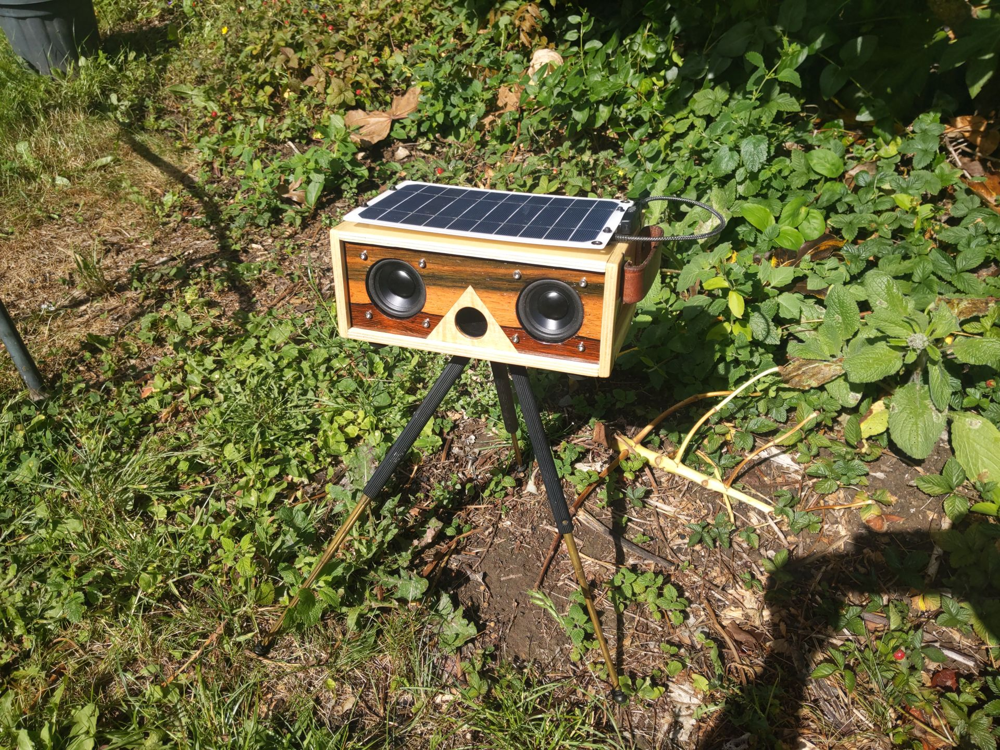
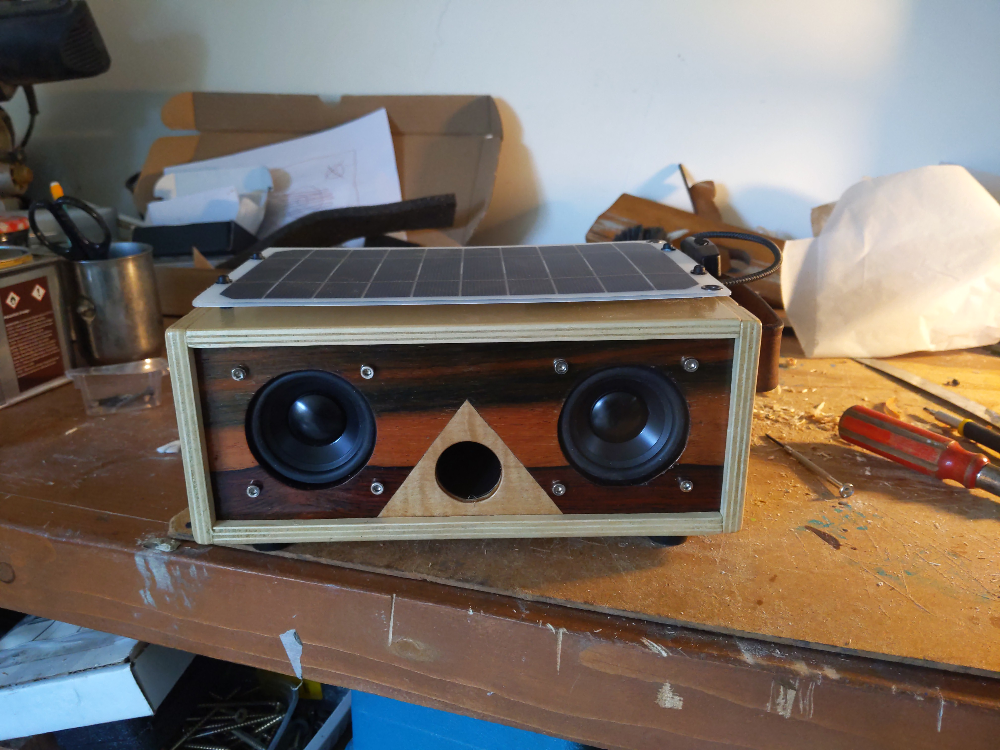
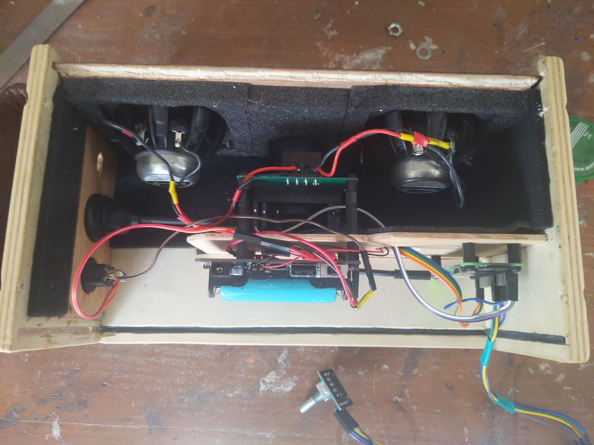
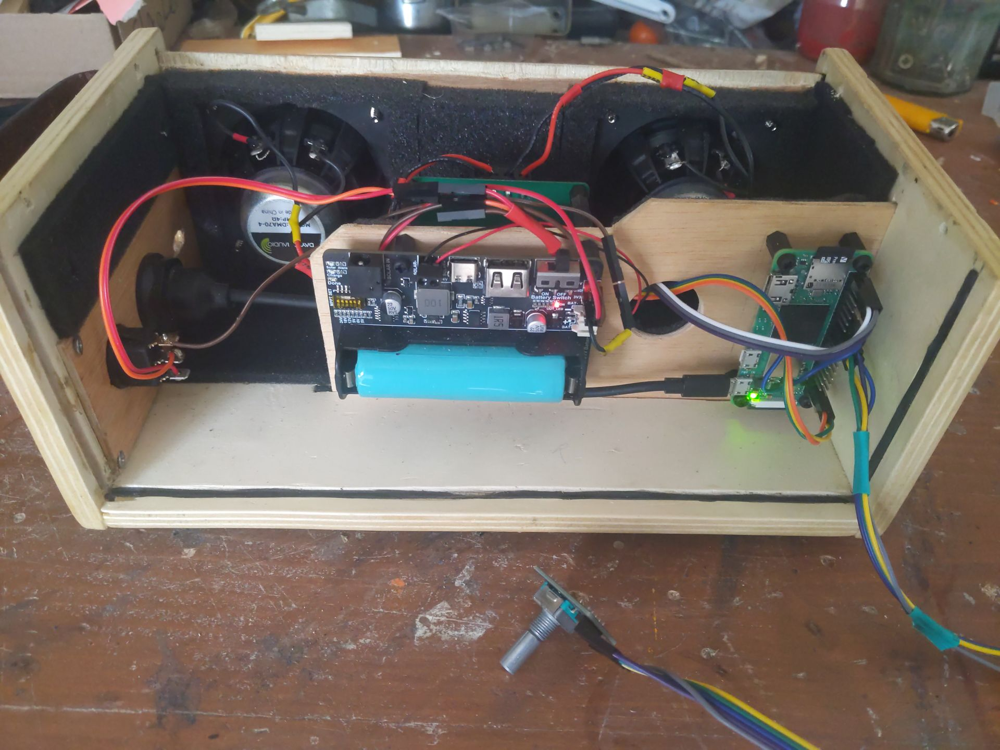
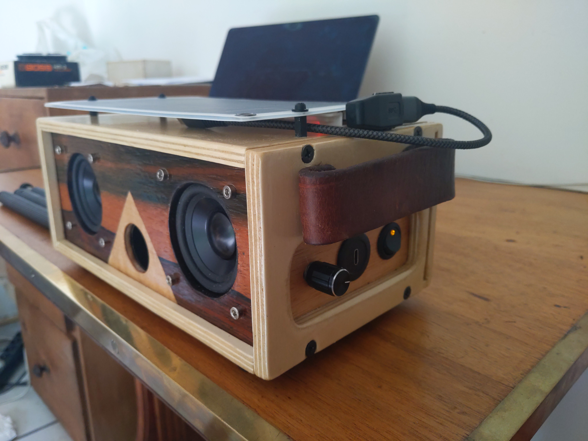

# 🎵 OaKhz Audio - Complete DIY Bluetooth Speaker System

High-quality DIY Bluetooth speaker built with Raspberry Pi Zero 2W, HiFiBerry MiniAmp, and CamillaDSP equalizer with web interface, sound feedback, and physical rotary controls.

This educational project aims to build a prototype of a Bluetooth speaker that is detachable, reusable, and repairable, using open-source softwares, standards, and norms as much as possible.

**GitHub Repository:** https://github.com/cstaelen/oakhz-diy-pizero-speaker

-- Written with Claude AI

---

[](./.github/img/photo.jpg)
[](./.github/img/photo2.jpg)
[](./.github/img/inside.jpg)
[](./.github/img/inside2.jpg)
[](./.github/img/side.jpg)

## 📦 What's Included

This complete system includes five components:

### 1. 🔊 [Base System - Bluetooth Speaker](./docs/README-v2-install.md) *(Required)*

The core audio system with Bluetooth streaming and CamillaDSP parametric equalizer.

**Features:**
- ✅ Bluetooth A2DP streaming (auto-pairing, no PIN)
- ✅ DSP audio pipeline: loudness, driver protection, stereo widening + 10-band parametric EQ (CamillaDSP 48kHz)
- ✅ Professional audio pipeline: Bluetooth → PulseAudio → Loopback → CamillaDSP → HiFiBerry DAC
- ✅ ALSA loopback for flexible routing
- ✅ Automatic device pairing (NoInputNoOutput)
- ✅ Hostname: "OaKhz Audio" (visible via Bluetooth)

**[📖 Read Full Installation Guide →](./docs/README-v2-install.md)**

---

### 2. 🎛️ [Web Equalizer Interface](./docs/README-v2-equalizer.md) *(Optional)*

Web-based control panel for CamillaDSP equalizer with real-time adjustments.

**Features:**
- 🌐 Web interface accessible from any device
- 🎚️ 10-band parametric EQ with preamp control
- 💾 Persistent EQ state (`~/.oakhz_eq.json`)
- ⚡ Real-time updates (HTTP REST → CamillaDSP SIGHUP)
- 📱 Mobile-responsive design
- 🎵 Media player controls (Play/Pause/Next/Previous)
- 📻 Real-time metadata display (Artist, Title, Album, Status)
- 🌀 Captive portal support (AP mode)

**Access:** `http://[raspberry-pi-ip]` or `http://192.168.50.1` (AP mode)

**[📖 Read Full Documentation →](./docs/README-v2-equalizer.md)**

---

### 3. 🔔 [Sound Feedback System](./docs/README-v2-sound.md) *(Optional)*

Audible notifications for system events through PulseAudio.

**Features:**
- 🎵 Ready sound (Bluetooth discoverable - C major arpeggio)
- 🎵 Connection sound (device connects/reconnects - high chime)
- 🎵 Shutdown sound (system powering off - descending arpeggio)
- 🔊 Ready/connect sounds at 80% via `paplay` through CamillaDSP
- 🔇 Shutdown sound via `aplay` direct to DAC (CamillaDSP stopped first)
- 🎯 Automatic PulseAudio routing through equalizer
- 🔄 Single device mode (auto-disconnect old connections)

**[📖 Read Full Documentation →](./docs/README-v2-sound.md)**

---

### 4. 🎛️ [Rotary Encoder Control](./docs/README-v2-rotary.md) *(Optional)*

Physical rotary encoder for tactile volume and media control.

**Features:**
- 🔄 Rotate: Volume up/down (±3% per step)
- 🔘 **Short press (<1s): Play/Pause** (Bluetooth media control)
- 🔘 Medium press (1s): Skip track
- ⏱️ Long press (3s): System shutdown
- 🎯 BlueZ MediaControl1 integration via D-Bus
- 🎵 Smart play/pause toggle (checks current status)
- 🔒 Thread-safe with 150ms throttling
- 👤 Runs as user `oakhz` (gpio + audio groups)

**GPIO Pins:** CLK=23, DT=24, SW=22

**[📖 Read Full Documentation →](./docs/README-v2-rotary.md)**

---

### 5. 📡 [WiFi Access Point](./docs/README-v2-accesspoint.md) *(Optional)*

Permanent WiFi Access Point with captive portal and file-based emergency recovery mode.

**Features:**
- 📡 Permanent AP mode by default (SSID: "OaKhz Wifi", password: `oakhzwifi`)
- 🌐 Captive portal — browser auto-opens on connection
- 🔒 WPA2 secured, IP `192.168.50.1`
- 🆘 Recovery mode: create `/boot/firmware/enable-wifi-client` on SD card to switch to WiFi client
- 💻 SSH always available

**Access:** AP mode → `http://192.168.50.1`

**[📖 Read Full Documentation →](./docs/README-v2-accesspoint.md)**

---

## 🚀 Quick Installation

### Prerequisites

- Raspberry Pi Zero 2W or Raspberry Pi 4
- Raspberry Pi OS Lite 64-bit
- HiFiBerry MiniAmp (or compatible DAC)
- 2x 4Ω 3W speakers
- KY-040 rotary encoder (optional)

### Installation Steps

```bash
# 1. Base System (Required)
sudo bash scripts/install.sh
sudo reboot

# 2. Web Equalizer Interface (Optional)
sudo bash scripts/setup-equalizer.sh

# 3. Sound Feedback (Optional)
sudo bash scripts/setup-sound.sh

# 4. Rotary Encoder (Optional)
sudo bash scripts/setup-rotary.sh

# 5. WiFi Access Point (Optional)
sudo bash scripts/setup-accesspoint.sh
sudo reboot
```

### After Installation

1. **Connect Bluetooth**: Look for "OaKhz Audio" on your phone
2. **Access Web Interface** *(if equalizer installed)*: `http://[Pi-IP]`
3. **Use Rotary Control** *(if rotary installed)*: Turn for volume, press for play/pause/skip

---

## 🛠️ Hardware Requirements

### Essential Components

| Component | Model | Price |
|-----------|-------|-------|
| **Raspberry Pi** | Zero 2W | ~€20 |
| **SD Card** | 16GB+ Class 10 | ~€10 |
| **Audio DAC** | HiFiBerry MiniAmp | ~€25 |
| **Power Supply** | 5V 3A USB-C | ~€10 |
| **Speakers** | 2x 4Ω 3W | ~€15 |
| **Total** | | **~€80** |

### Optional Components

| Component | Model | Price |
|-----------|-------|-------|
| **Rotary Encoder** | KY-040 | ~€2 |
| **Enclosure** | 3D printed or custom | Variable |

---

## 📊 System Architecture

```
┌─────────────────────────────────────────────────────────┐
│                    User Interfaces                      │
├─────────────────────────────────────────────────────────┤
│  Web Browser     │  Bluetooth Device  │  Rotary Encoder │
│  (Equalizer)     │  (Audio Source)    │  (Volume/Skip)  │
│  Port 80         │                    │  GPIO 23/24/22  │
└────────┬─────────┴─────────┬──────────┴────────┬────────┘
         │                   │                   │
┌────────▼───────────────────▼───────────────────▼────────┐
│                 Audio Processing Layer                   │
├──────────────────────────────────────────────────────────┤
│  Flask Server  │  PulseAudio    │  pactl (Volume)       │
│  (Python)      │  (System Mode) │  (Rotary Control)     │
└────────┬───────┴───────┬────────┴───────────────────────┘
         │               │
┌────────▼───────────────▼────────────────────────────────┐
│              Sound Feedback & Routing                    │
├──────────────────────────────────────────────────────────┤
│  Audio Events  │  Bluetooth     │  Auto-routing         │
│  (paplay 80%)  │  Monitor       │  (switch-on-connect)  │
│  - Ready       │  - Connection  │                        │
│  - Shutdown    │  - Single dev  │                        │
└────────┬───────┴───────┬────────┴────────────────────────┘
         │               │
┌────────▼───────────────▼─────────────────────────────────┐
│                 ALSA Loopback Layer                      │
│  hw:Loopback,0 ──────────→ hw:Loopback,1                │
└────────────────────────┬─────────────────────────────────┘
                         │
┌────────────────────────▼─────────────────────────────────┐
│           CamillaDSP DSP Processor @ 48kHz               │
│  Loudness / Protection / Stereo Wide / 10-band EQ        │
│  WebSocket: 1234                                         │
└────────────────────────┬─────────────────────────────────┘
                         │
┌────────────────────────▼─────────────────────────────────┐
│              HiFiBerry MiniAmp (I2S DAC)                 │
│              hw:1,0 (Card 1)                             │
└────────────────────────┬─────────────────────────────────┘
                         │
                    ┌────▼─────┐
                    │ Speakers │
                    │  🔊 🔊   │
                    └──────────┘
```

---

## 🎯 Key Features

### Audio Quality
- **48kHz/16-bit** audio pipeline
- **Professional DSP** with CamillaDSP
- **Zero latency** Bluetooth routing
- **HiFiBerry DAC** for superior sound quality

### User Experience
- **Auto-pairing** Bluetooth (no PIN)
- **Web interface** with media player controls
- **Real-time metadata display** (Artist, Title, Album, Status)
- **Physical media controls** with rotary encoder (Play/Pause/Next)
- **Audio feedback** for system events
- **Real-time** equalizer adjustments
- **Preamp master volume** control

### Technical Excellence
- **Thread-safe** volume control with locking
- **Debounced** controls (150ms throttling)
- **BlueZ D-Bus integration** for media controls (MediaControl1 & MediaPlayer1)
- **Smart play/pause toggle** (status-aware)
- **Single device mode** (auto-disconnect old devices)
- **PulseAudio system mode** for stability
- **Systemd services** for automatic startup

---

## 📱 Usage

### Bluetooth Playback
1. On your phone, look for "OaKhz Audio" in Bluetooth settings
2. Connect (no PIN required)
3. Play music - audio routes automatically through equalizer

### Web Interface
1. Open `http://[Raspberry-Pi-IP]` (AP mode: `http://192.168.50.1`)
2. **Now Playing section** shows:
   - 🎵 Current track (Artist, Title, Album)
   - ⏯️ Playback status (Playing/Paused/Stopped)
   - Auto-updates every 2 seconds
3. **Media Controls**:
   - ⏮ Previous track
   - ▶️/⏸ Play/Pause (smart toggle)
   - ⏭ Next track
4. **Equalizer**:
   - 10-band parametric EQ (-12dB to +12dB per band)
   - Preamp master volume control
   - Changes apply in real-time via CamillaDSP reload

### Rotary Controls
- **Turn left/right**: Volume ±3%
- **Press briefly (<1s)**: **Play/Pause** Bluetooth media
- **Press medium (1s)**: Skip to next track
- **Hold 3 seconds**: Shutdown system

---

## 🔧 Services Overview

| Service | Purpose | Status Command |
|---------|---------|----------------|
| **bluetooth.service** | Bluetooth daemon | `sudo systemctl status bluetooth` |
| **bt-agent.service** | Auto-pairing (NoInputNoOutput) | `sudo systemctl status bt-agent` |
| **pulseaudio.service** | System audio + BT routing | `sudo systemctl status pulseaudio` |
| **camilladsp.service** | DSP processor (port 1234) | `sudo systemctl status camilladsp` |
| **oakhz-equalizer.service** | Web interface (port 80) | `sudo systemctl status oakhz-equalizer` |
| **oakhz-audio-events.service** | Startup/connect sounds + BT monitor | `sudo systemctl status oakhz-audio-events` |
| **oakhz-shutdown-sound.service** | Shutdown sound (before halt) | `sudo systemctl status oakhz-shutdown-sound` |
| **oakhz-rotary.service** | Rotary encoder controller | `sudo systemctl status oakhz-rotary` |
| **oakhz-recovery-mode.service** | Boot-time WiFi mode selector | `sudo systemctl status oakhz-recovery-mode` |
| **wlan0-ap.service** | Static IP for AP mode | `sudo systemctl status wlan0-ap` |
| **hostapd.service** | WiFi Access Point | `sudo systemctl status hostapd` |
| **dnsmasq.service** | DHCP + DNS + captive portal | `sudo systemctl status dnsmasq` |

---


## 📚 Documentation Structure

```
OAKHZ_DOC/
├── README.md                         # Project overview
├── docs/                             # Documentation
│   ├── README-v2-install.md          # Base system installation guide
│   ├── README-v2-equalizer.md        # Web equalizer interface
│   ├── README-v2-sound.md            # Sound feedback system
│   ├── README-v2-rotary.md           # Rotary encoder control
│   └── README-v2-accesspoint.md      # WiFi Access Point
├── scripts/                          # Installation scripts
│   ├── install.sh                    # Base system installer
│   ├── setup-equalizer.sh            # Web equalizer installer
│   ├── setup-sound.sh                # Sound feedback installer
│   ├── setup-rotary.sh               # Rotary encoder installer
│   └── setup-accesspoint.sh          # WiFi AP installer
└── system-files/                     # Config files copied to the Pi
```

---

## 📦 Component Dependencies

```
Base System (Required)
    ↓
    ├── Web Equalizer (Optional) ← Depends on CamillaDSP from base
    ├── Sound Feedback (Optional) ← Depends on PulseAudio from base
    ├── Rotary Encoder (Optional) ← Depends on PulseAudio from base
    └── WiFi AP (Optional) ← Independent, works with all components
```

**Installation order:**
1. Always install Base System first
2. Add optional components in any order
3. WiFi AP is completely independent

---

## 🔒 Security & Performance

- **User separation**: Services run as appropriate users (`oakhz`, `pulse`, `root`)
- **Minimal permissions**: Only required groups (gpio, audio)
- **Low resource usage**: ~50MB RAM total for all services
- **No network exposure**: Only local web interface (port 80)
- **Automatic updates**: Use `sudo apt update && sudo apt upgrade`


## 📜 License

GPL-3.0 License - Free to use, modify, and redistribute

